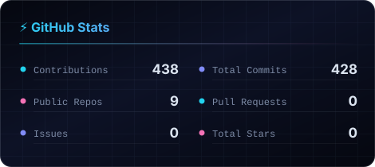

<!--
  ─────────────────────────────────────────────────────────────
  GitHub Profile README — github.com/kasra-nikshabani
  Lives in the repo kasra-nikshabani/kasra-nikshabani (branch: main)
  TODO before pushing: confirm the LinkedIn / Telegram / Portfolio
  links below — they are guesses based on your handle.
  ─────────────────────────────────────────────────────────────
-->

<div align="center">
  
</div>

<div align="center">

[](https://linkedin.com/in/kasra-nikshabani)
[](https://t.me/kasra_nikshabani)
[](mailto:kasranikshabani3@gmail.com)


</div>


## 🧭 About

```js
const kasra = {
  role:     "Full-Stack Developer",
  at:       "Foolad Mobarakeh Sepahan",
  from:     "Iran 🇮🇷",
  frontend: ["React.js", "JavaScript", "HTML", "CSS"],
  backend:  ["Java", "Spring Boot", "Node.js", "Go"],
  learning: ["TypeScript", "Docker", "PostgreSQL", "System design"],
  motto:    "Build it simple, make it work, then make it good.",
};
```

- 💼 &nbsp;Full-stack developer at **Foolad Mobarakeh Sepahan** — building internal web tools end-to-end.
- 🧩 &nbsp;Comfortable across the stack: **React** on the front, **Java / Spring Boot**, **Node.js** and **Go** on the back.
- 📚 &nbsp;Currently leveling up on **TypeScript**, **Docker**, and **backend architecture**.
- 🤝 &nbsp;Open to collaborating on open-source projects — especially web apps and developer tooling.
- 💬 &nbsp;Ask me about **Java & Spring Boot, JavaScript, React, Node.js, or Go**.
- 📫 &nbsp;Reach me at **kasranikshabani3@gmail.com**


## 🛠️ Tech Stack

<table>
<tr>
<td valign="top" width="50%">

**Languages**


**Frontend**


</td>
<td valign="top" width="50%">

**Backend & Data**


**Tools**


</td>
</tr>
</table>

**📖 Currently learning**


## 📊 GitHub Analytics

<div align="center">

<!-- Self-hosted cards, regenerated every 6h by .github/workflows/stats.yml -->



<picture>
  <source media="(prefers-color-scheme: dark)" srcset="https://streak-stats.demolab.com?user=kasra-nikshabani&hide_border=true&background=0D1117&ring=22d3ee&fire=f472b6&currStreakLabel=818cf8&sideLabels=c9d1d9&dates=8b949e&currStreakNum=c9d1d9&sideNums=c9d1d9" />
  
</picture>

</div>

### 📈 Contribution Activity

<div align="center">
  <picture>
    <source media="(prefers-color-scheme: dark)" srcset="https://github-readme-activity-graph.vercel.app/graph?username=kasra-nikshabani&bg_color=0d1117&color=c9d1d9&line=22d3ee&point=f472b6&area_color=818cf8&area=true&hide_border=true&custom_title=Contributions%20—%20last%2031%20days" />
    
  </picture>
</div>

### 🐍 Contribution Snake

<div align="center">
  <picture>
    <source media="(prefers-color-scheme: dark)" srcset="https://raw.githubusercontent.com/kasra-nikshabani/kasra-nikshabani/output/snake-dark.svg" />
    
  </picture>
</div>


## 🚀 Projects

| Project | What it is | Built with |
| :-- | :-- | :-- |
| **[sepahanticket](https://github.com/kasra-nikshabani/sepahanticket)** | Ticketing front-end for Foolad Mobarakeh Sepahan football club | `HTML` `CSS` `JS` |
| **[museum_sepahan](https://github.com/kasra-nikshabani/museum_sepahan)** | Web presence for the Sepahan club museum | `HTML` `CSS` |
| **[regex-validator](https://github.com/kasra-nikshabani/regex-validator)** | Email and phone-number validation utility | `Java` |

<details>
<summary><b>📂 How I work</b></summary>

<br>

| Principle | What it means in practice |
| :-- | :-- |
| **Ship small, ship often** | One branch per unit of work, small reviewable commits |
| **Readable > clever** | Code is read far more often than it's written |
| **Understand before copying** | I'd rather write 10 lines I understand than paste 100 I don't |
| **Finish what I start** | A working small feature beats an unfinished big one |

```bash
❯ git switch -c feat/thing      # branch per unit of work
❯ npm test && npm run lint      # green locally before pushing
❯ gh pr create --fill           # small, reviewable diffs
```

</details>


<div align="center">

**Thanks for stopping by — let's build something.** ⚡

<sub>⭐ Star anything you find useful.</sub>

</div>
